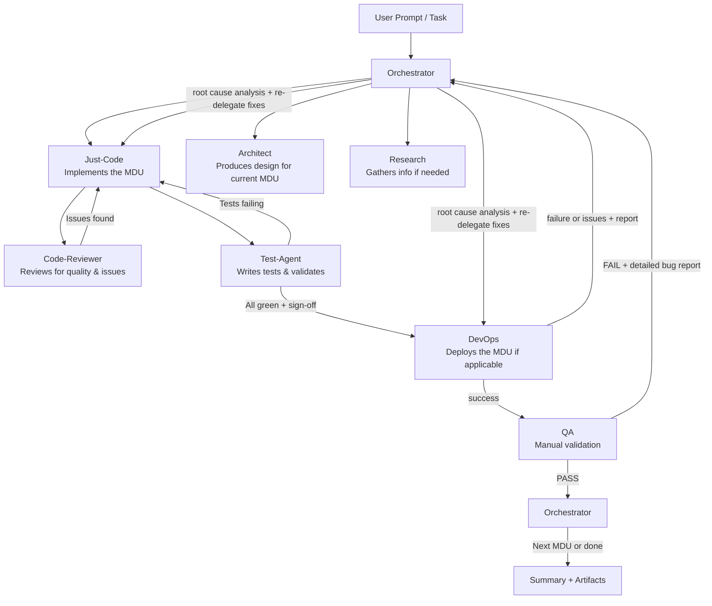
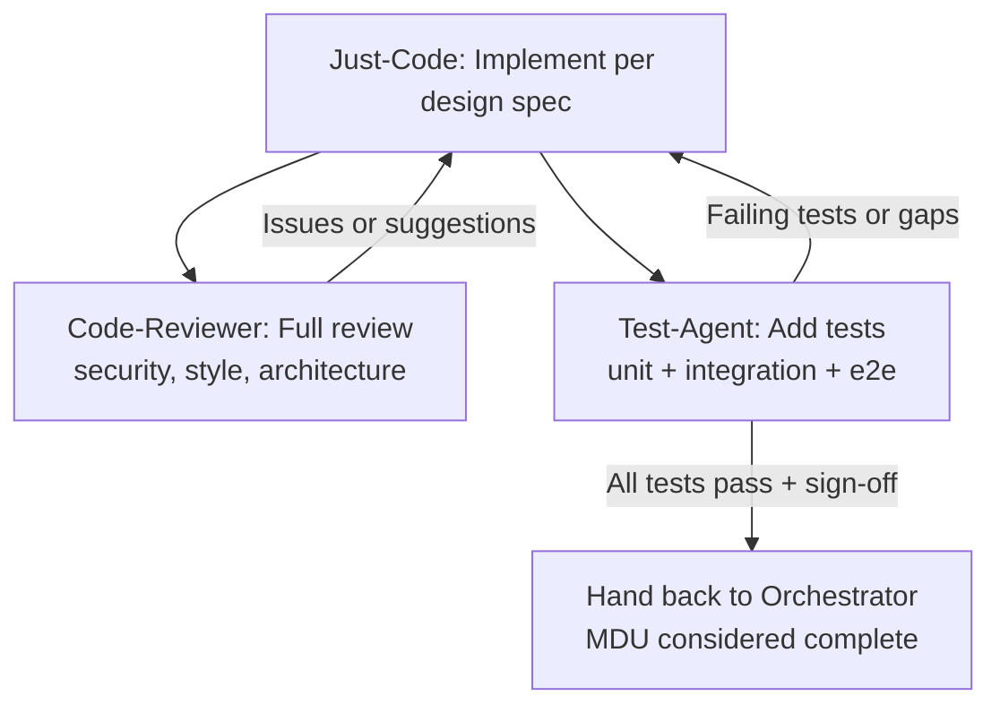

# Open Agent Definitions

> **Disclaimer**: All of the code and agent definitions in this repo were written by AI, not by the author directly, so use with caution. Just because this repo's author trusts them doesn't mean you should.

These are generic, reusable agent definitions for [OpenCode](https://opencode.ai), [Grok Build](https://x.ai) (the `grok` CLI from xAI), and [Claude Code](https://claude.com/claude-code) (the `claude` CLI from Anthropic) which have been distilled from my own, very personal and workflow specific agent definitions into something shareable. How I use these is overlaying my own workflow specific deltas (see below for details) to personalize them for how I like to work. These agents represent a "team" with specific focus or specialization areas. Whenever I'm working on a project, I start with the orchestrator, and have it farm out tasks to the other agents. Having specialized agents like this allows me to a) minimize per-agent context, and b) implement guardrails in the form of inter-agent checks and balances (e.g. to prevent the just-code agent from cheating on tests by updating the tests).

I'm not promising these are the best agents out there, nor the best agent team/stack, but they are MY agents, and this is the setup I use daily. It's constantly being refined, so if you're following, check back every now and again.

This repository provides a **base layer** of agent definitions designed to be broadly applicable across different projects and users. The prompts have been kept focused on core responsibilities rather than any single team's specific workflows or tooling.

## Prerequisites

### OpenCode Go Subscription

The OpenCode agent definitions in this repo are configured to use **OpenCode Go** subscription models (`opencode-go/*`) as the primary workhorses for most coding, testing, review, and deployment tasks. These agents reference models like `opencode-go/deepseek-v4-flash`, `opencode-go/kimi-k2.7-code`, and `opencode-go/deepseek-v4-pro` which require an active [OpenCode Go subscription](https://opencode.ai/docs/go) ($10/month).

A few agents use **free Zen models** (`opencode/*` or `opencode-zen/*`) for research and simple fallback tasks, but the default agents for the main MDU loop (just-code, test-agent, code-reviewer, devops, qa, architect) all require Go models.

> **If you don't have an OpenCode Go subscription**, the agents will still deploy but will fail at runtime when they try to call Go models. You'll need to either:
> - Subscribe to OpenCode Go ($10/month), or
> - Manually edit `opencode.json` to swap all `opencode-go/*` model references to `opencode/*` (free Zen) models.

### Grok Build / Claude Code

The Grok Build profiles and Claude Code subagents use their own model backends and are not affected by the Go subscription requirement — they work as long as you have the respective CLI installed.

## Using These Agents As-Is

1. Clone or download this repository.
2. (Optional) Stage a validated `build/` directory:

   ```bash
   ./build.sh
   ```

3. Deploy to your local OpenCode, Grok Build, and/or Claude Code config directories:

   ```bash
   ./deploy.sh --force
   ```

   Or rebuild and deploy in one step:

   ```bash
   ./deploy.sh --force --rebuild
   ```

This installs:
- **OpenCode**: `opencode.json` and `prompts/` → `~/.config/opencode/`
- **Grok Build**: `grok/agents/*.md` → `~/.grok/agents/`
- **Claude Code**: `claude/agents/*.md` → `~/.claude/agents/` (user-level subagents)

`deploy.sh` auto-detects which of the three CLIs (`opencode`, `grok`, `claude`) are installed and only deploys to the ones present; it errors only if none are found.

The `opencode.json` file in the root provides a ready-to-use set of agents. You can use it directly, copy sections from it, or merge it with your existing configuration.

The Claude Code subagents are **generated at build time** from `opencode.json` (roster + descriptions) and `prompts/*.md` (the canonical, provider-neutral system prompts), so there is no separate `claude/` source tree to maintain — they always stay in sync with the OpenCode definitions. Each generated file is Markdown with YAML frontmatter (`name`, `description`) followed by the system prompt body; `model` is intentionally omitted so each subagent inherits your configured Claude Code model.

### For Grok Build only

After `./deploy.sh --force`, invoke profiles with:

You can also use profiles directly with:

```bash
grok --agent just-code -p "Implement a small feature..."
```

(Profiles can be copied manually to `~/.grok/agents/` or project `.grok/agents/` if preferred.)

### For Claude Code only

After `./deploy.sh --force`, the subagents are installed to `~/.claude/agents/`. Claude Code discovers user-level subagents there automatically — list and inspect them with the interactive `/agents` command, or invoke one for a session with:

```bash
claude --agent just-code -p "Implement a small feature..."
```

(Files can be copied manually to `~/.claude/agents/` or project `.claude/agents/` if preferred.)

### Core Agents Included

The agent definitions follow a **model tier variant** pattern — each role has multiple clones configured with different models so the orchestrator can spread token cost and choose the cheapest reliable model for each subtask.

**OpenCode agents** (defined in `opencode.json` and `prompts/`):

**Orchestrator:**
- `orchestrator` — Primary coordinator. Uses free Zen model (big-pickle).

**Research** (free / budget models — cheapest tier):
- `research` — Quick web lookups (free: deepseek-v4-flash-free)
- `deepseek-research` — Coding patterns, library docs (free: nemotron-3-ultra-free)
- `nemotron-research` — Thorough doc research (free: north-mini-code-free)
- `deep-research` — Comprehensive multi-source research (Go budget: mimo-v2.5)

**Coding** (spread across tiers — most-used role):
- `just-code` — Default coder (Go budget: deepseek-v4-flash, ~$0.14/M tokens)
- `just-code-mid` — Complex features needing deeper reasoning (Go mid: kimi-k2.7-code)
- `just-code-pro` — Architecture-sensitive code, refactoring (Go premium: deepseek-v4-pro)
- `just-code-free` — Boilerplate, simple changes (free: big-pickle)

**Testing:**
- `test-agent` — Default test writer (Go budget: deepseek-v4-flash)
- `test-agent-mid` — Complex test suites, property-based tests (Go mid: minimax-m3)
- `test-agent-pro` — Security tests, deep coverage (Go premium: kimi-k2.7-code)
- `test-agent-free` — Simple unit tests (free: big-pickle)

**Code Review:**
- `code-reviewer` — Standard review (Go mid: minimax-m3)
- `code-reviewer-pro` — Deep security audit, architecture review (Go premium: deepseek-v4-pro)
- `code-reviewer-free` — Quick lint/style check (free: big-pickle)

**Architecture:**
- `architect` — Design docs, API specs (Go premium: deepseek-v4-pro)
- `architect-premium` — Complex system design, ADRs (Go top-tier: glm-5.2)

**DevOps:**
- `devops` — Standard deploys, Docker, CI/CD (Go mid: minimax-m3)
- `devops-pro` — Complex multi-service deploys, IaC (Go premium: deepseek-v4-pro)
- `devops-free` — Simple config changes (free: big-pickle)

**QA:**
- `qa` — Standard validation (Go mid: minimax-m3)
- `qa-pro` — Thorough regression, edge case validation (Go premium: kimi-k2.7-code)
- `qa-free` — Basic smoke tests (free: big-pickle)

**UI/UX Design:**
- `ui-ux-designer` — Standard design work (Go mid: minimax-m3)
- `ui-ux-designer-pro` — Polished production UI, design systems (Go premium: kimi-k2.7-code)

**Grok Build profiles** (in `grok/agents/`):

A matching set of the same agent roles, using Grok models (separate xAI subscription):

- `orchestrator` (grok-4.3)
- `just-code`, `just-code-mid`, `just-code-pro` (grok-build-0.1 / grok-4.3)
- `test-agent`, `test-agent-pro` (grok-build-0.1 / grok-4.3)
- `code-reviewer`, `code-reviewer-pro` (grok-4.3 / grok-4.20-reasoning)
- `architect`, `architect-premium` (grok-4.3 / grok-4.20-reasoning)
- `devops`, `devops-pro` (grok-4.3)
- `qa`, `qa-pro` (grok-4.3)
- `research` (grok-4.3)
- `ui-ux-designer`, `ui-ux-designer-pro` (grok-build-0.1 / grok-4.3)

Invoke with `grok --agent <name>` (e.g. `grok --agent just-code` or `grok --agent code-reviewer-pro`).

**Claude Code subagents** (generated into `claude/agents/` during the build):

All 26 OpenCode agents are emitted as Claude Code user-level subagents — each `.md` file is generated from `opencode.json` + `prompts/` at build time. The `model` is intentionally omitted so each subagent inherits your configured Claude Code model. Invoke them with `claude --agent <name>` or pick them in the interactive `/agents` view.

## How the Agents Work Together

These definitions are designed as a **collaborative team** rather than standalone tools. The `orchestrator` acts as the project manager, breaking work into **Minimum Deployable Units (MDUs)** and delegating to specialists. Built-in handoffs (especially mandatory review + test sign-off) create guardrails.

### Orchestrator Delegation Flow



The orchestrator ensures every MDU is **designed → implemented → reviewed → tested → deployed → validated** before moving on.

**Failure / feedback loops for autonomy:**
- On DevOps failure or post-deploy issues: DevOps returns a diagnostic report. The orchestrator performs (or delegates) root cause analysis and re-delegates fixes — typically back to DevOps for infra retries, or to Just-Code/Architect if code or config changes are needed. The MDU is re-deployed and re-validated until it succeeds.
- On QA FAIL: QA returns detailed, severity-ranked bug reports with reproduction steps. The orchestrator routes the fixes (usually to Just-Code + Test-Agent for functional issues, or DevOps for deployment-related problems), then re-executes the deploy + validate phases. The loop continues until the MDU receives a clean PASS from QA (and successful DevOps).

### Just-Code + Review + Test Iteration Loop

The `just-code` agent is deliberately not allowed to declare victory alone:



This loop continues until **both** the reviewer and tester are satisfied. The orchestrator will not mark the MDU done without these sign-offs.

### Example Project Prompt

```text
Build a simple REST API for a todo list using Node.js and Express.

Core requirements:
- Full CRUD for todos (title, description, completed status)
- In-memory storage to start (we can add a DB later)
- Basic input validation and error handling
- Follow clean, maintainable code practices

Please treat this as a series of Minimum Deployable Units. Start by having the architect produce a short design, then deliver one small, fully tested and reviewed slice at a time. I want working code + tests + review sign-off for each unit before moving to the next.
```

### How It Triggers the Agents (Example Walkthrough)

1. You run the prompt above against the `orchestrator` (e.g. `grok --agent orchestrator -p "..."` or via your OpenCode setup).

2. **Orchestrator** decomposes into MDUs (e.g.):
   - MDU 1: Project skeleton + basic Express server + health endpoint
   - MDU 2: Todo model + GET /todos + POST /todos
   - MDU 3: PUT /todos/:id + DELETE /todos/:id + validation
   - MDU 4: Error handling + basic tests across all endpoints

3. For MDU 1 it calls:
   - `architect` → produces `design-mdu1.md`
   - `just-code` (passing the design) → implements the server

4. **Just-Code** finishes its changes → hands off.

5. **Iteration Loop** (just-code ↔ reviewer ↔ test-agent):
   - `code-reviewer` reviews → finds missing error handling on one endpoint → sends feedback
   - `just-code` fixes → re-submits
   - `test-agent` writes tests → one test fails because of a status code bug → sends feedback
   - `just-code` fixes again
   - Both reviewer and tester now sign off

6. **Orchestrator** receives the completed MDU (with design doc, code diff, review comments, passing tests) and hands it to `devops`.

7. **DevOps** attempts deployment. If it fails or produces errors (e.g., port conflict or missing env var), it returns a diagnostic report. The orchestrator routes the fix (e.g., back to `just-code` for a config change or to `devops` for retry with better logging). The MDU is re-deployed until DevOps succeeds cleanly.

8. **QA** then performs validation. On FAIL (e.g., an endpoint returns 500 under load or a UI flow is broken), QA returns detailed bug reports with reproduction steps. The orchestrator root-causes the issue (delegating to `research` if needed) and re-delegates fixes — typically to `just-code` + `test-agent` for functional bugs, or `devops` for infra-related problems. It then re-triggers deploy + QA until the MDU receives a clean PASS.

9. Process repeats for subsequent MDUs. Final response from the orchestrator includes:
   - Summary of delivered units
   - Links to design docs, code, tests, deploy outputs
   - Any open questions or next steps

This structure keeps context small per agent while enforcing quality through mandatory collaboration, MDU discipline, **and autonomous failure recovery loops** at every phase (including post-deploy and post-QA).

This structure keeps context small per agent while enforcing quality through mandatory collaboration and the MDU discipline.

## Updating These Definitions with an AI Agent


One of the most powerful (and meta) things you can do with this repository is use an AI coding agent to improve the agent definitions themselves.

This repo is structured so that the OpenCode versions live in `prompts/<name>.md` and the corresponding Grok Build versions live in `grok/agents/<name>.md`. This makes it easy to keep behavior consistent across both tools. The Claude Code subagents are not hand-authored — they are generated from `prompts/<name>.md` + `opencode.json` during the build, so editing the OpenCode prompt is enough to update the Claude Code version too.

### Example Prompt to Update Both Versions at Once

If you have this repo checked out and are using an AI coding agent (such as the `grok` CLI or OpenCode itself), you can give it a prompt like this:

```
Please update BOTH the OpenCode version and the Grok Build version of the "just-code" agent so that it is only allowed to write code in x86 assembly language.

- OpenCode version: prompts/just-code.md
- Grok Build version: grok/agents/just-code.md

Make the constraints and instructions as consistent as possible between the two files. Do not change the overall structure or responsibilities of the agent unless necessary to enforce the x86 assembly rule. After editing, briefly summarize what you changed in each file.
```

Key tips:
- Always be explicit: say "BOTH the file in prompts/ AND the file in grok/agents/".
- Reference the exact relative paths.
- Ask the agent to keep the two versions consistent.
- You can use the same pattern for any agent (orchestrator, code-reviewer, architect, etc.).

This approach lets you evolve the entire "dual" definition set (OpenCode + Grok) in a single conversation without having to remember the internal structure.

## Extending with Your Own Overlays (Recommended Pattern)

The most powerful way to use this repository is as a **stable base** that you layer your own customizations on top of.

### The Two-Layer Model

- **Base (this repo)**: Generic, well-tested agent roles and prompts.
- **Overlays (your repo)**: Project-specific rules, domain knowledge, custom agents, MCP integrations, style guides, and workflow instructions.

This separation keeps the public base clean while letting you (or your team) maintain powerful, opinionated behavior.

### Base ↔ Overlay Contract

This repo is the **public generic base**. Your private or team-specific customizations belong in a **separate overlay repository** — never committed here.

Overlay projects consume this base via the `GENERIC_DIR` environment variable (or by placing this repo as a sibling directory named `base_agents`, `open-agent-definitions`, or `open_agent_definitions`).

**Expected overlay build flow:**

1. Run **this repo's** `./build.sh` (or read from `build/` if already staged) to get validated generic definitions.
2. Merge personal overlays (appended rules, custom agents, MCP config, extra skills).
3. Regenerate Claude Code subagents from the merged `opencode.json` + `prompts/` so overlay deltas flow through to Claude too.
4. Validate the combined `build/` output (JSON syntax, prompt file references, Grok frontmatter, Claude subagent frontmatter).
5. Deploy **only** from the combined `build/` directory — do not re-deploy the generic base separately.

### Creating Your Own Overlay Repository

A typical private overlay repo structure:

```
my-overlays/                   # private repo — your rules, MCPs, custom agents
├── README.md
├── build.sh                   # thin entry point → scripts/build.sh
├── deploy.sh                  # thin entry point → scripts/deploy.sh
├── scripts/
│   ├── build.sh               # stage base + merge overlays + validate
│   ├── deploy.sh              # install from build/ + CLI validation
│   └── lib/                   # shared helpers (detect GENERIC_DIR, merge JSON, etc.)
├── overlays/
│   ├── manifest.json          # which snippet files apply globally vs per-agent
│   ├── team-coding-standards.txt   # example: snippet appended to all agents
│   ├── prompts/               # full prompt overrides (optional)
│   ├── grok/agents/           # full grok profile overrides (optional)
│   └── opencode-mcp.json      # MCP servers to merge into opencode.json
└── build/                     # generated output (gitignored) — deploy from here
```

#### overlays/manifest.json (recommended)

Declare overlay snippets declaratively instead of hard-coding agent names in build scripts:

```json
{
  "global_snippets": ["team-coding-standards.txt"],
  "agent_snippets": {
    "devops": ["deploy-safety-rules.txt"],
    "just-code": ["monorepo-conventions.txt"]
  }
}
```

Global snippets are appended to every base prompt/profile. Per-agent snippets are appended only to matching agent stems (e.g. `devops` applies to both `prompts/devops.md` and `grok/agents/devops.md`).

Full files in `overlays/prompts/` or `overlays/grok/agents/` replace the base copy for that agent name.

You don't author overlays for Claude Code separately: because the Claude Code subagents are generated from the merged `opencode.json` + `prompts/` *after* overlays are applied, any global/per-agent snippet or full-prompt override automatically flows into the corresponding `~/.claude/agents/<name>.md` file.

### What Belongs in an Overlay?

Useful things to put in overlays include:

- **Shared rules** — Coding standards, commit message formats, architectural principles, or safety constraints you want every agent to follow.
- **Domain-specific agents** — Custom agents for your tech stack, company processes, or niche problem domain.
- **MCP and tool configuration** — Private or project-specific MCP servers.
- **Workflow instructions** — How you like tasks broken down, review processes, deployment pipelines, etc.
- **Model preferences** — Default models, temperatures, or effort levels for certain roles.
- **Additional prompts** — Full specialized agents that build on the base roles.

### Tips for Healthy Overlays

- Prefer **appending** rules to base prompts rather than forking them when possible. This makes it easier to pull updates from the base repo later.
- Keep your overlay prompts focused and well-documented.
- Version your overlay repo together with your main projects so the combination stays consistent.
- Document in your overlay README which base agents you use and what customizations you've applied.

## Repository Layout (Base)

```
base_agents/                   # this public repo
├── build.sh                   # stage source → build/, generate Claude agents, validate
├── deploy.sh                  # install from build/ (or root fallback)
├── scripts/                   # modular build/deploy implementation
│   └── lib/gen_claude_agents.py  # generates claude/agents/ from opencode.json + prompts/
├── opencode.json              # OpenCode agent registry (26 agents across model tiers)
├── prompts/                   # OpenCode prompt bodies (canonical system prompts)
│   ├── orchestrator.md        # includes model selection guide for variant-aware delegation
│   ├── just-code.md           # token-frugal coding instructions
│   ├── test-agent.md          # token-frugal test writing
│   ├── code-reviewer.md       # token-frugal review
│   ├── architect.md           # token-frugal design
│   ├── devops.md              # token-frugal infrastructure
│   ├── qa.md                  # token-frugal validation
│   ├── research.md            # token-frugal information gathering
│   └── ui-ux-designer.md      # token-frugal design work
├── grok/agents/               # Grok Build agent profiles (18 profiles)
│   ├── orchestrator.md
│   ├── just-code.md / just-code-mid.md / just-code-pro.md
│   ├── test-agent.md / test-agent-pro.md
│   ├── code-reviewer.md / code-reviewer-pro.md
│   ├── architect.md / architect-premium.md
│   ├── devops.md / devops-pro.md
│   ├── qa.md / qa-pro.md
│   ├── research.md
│   └── ui-ux-designer.md / ui-ux-designer-pro.md
└── build/                     # generated output (gitignored)
    ├── opencode.json
    ├── prompts/
    ├── grok/agents/
    └── claude/agents/         # generated Claude Code subagents (26 files)
```

## Getting Started with Your Own Setup

1. Clone **this repository** as your public/generic base.
2. Create a **separate private overlay repository** for your workflow rules, MCP servers, and custom agents.
3. Point the overlay at this base via `GENERIC_DIR` or a sibling directory.
4. Have the overlay `build.sh` run this repo's `build.sh`, merge overlays, and validate.
5. Have the overlay `deploy.sh` install only from the combined `build/` output.
6. Iterate on overlays independently; pull base updates when the generic layer improves.

This pattern gives you powerful, personalized agents while still benefiting from improvements to the shared foundation.

**Discoverability note for AI agents / overlay projects**: When this base is used from a personal or team overlay project (often a sibling directory on disk with its own `overlays/`, `build.sh`, and `deploy.sh`), the AI session context will typically start in the overlay project. That project's steering files (README.md or AGENTS.md) will explicitly instruct the AI to read *this* README first for the generic foundation before applying any local overlays. This ensures the root shareable repo is always discoverable.

## TODO

- **Split agent definitions into Go-only and Zen-only variants**: The current `opencode.json` assumes an OpenCode Go subscription for most agents. Create a parallel set of agents that use only free Zen models (`opencode/*`) for users without a Go subscription. This could be a separate `opencode.zen.json` file or a build-time flag. The Go variant should remain the default since it provides the best cost-to-capability ratio, but a Zen-only fallback set would make the repo usable by a wider audience without requiring a subscription.

## Contributing

Improvements to the generic layer are welcome. When contributing, please keep prompts focused on general-purpose behavior so they remain useful as a base for many different overlay projects.

---

*This repository is intended to be used as a foundation. The real power comes when you combine it with your own overlays.*

## License

This project is released under [The Unlicense](https://unlicense.org/).
